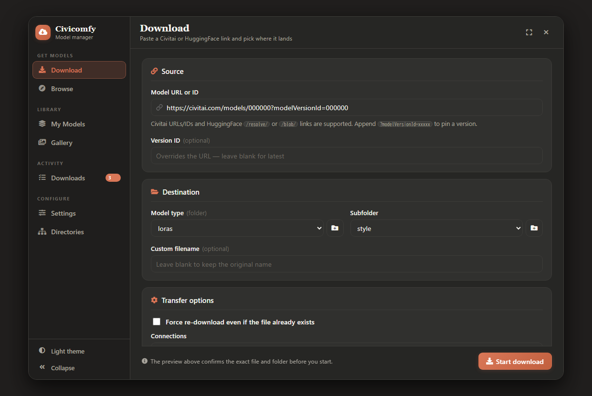
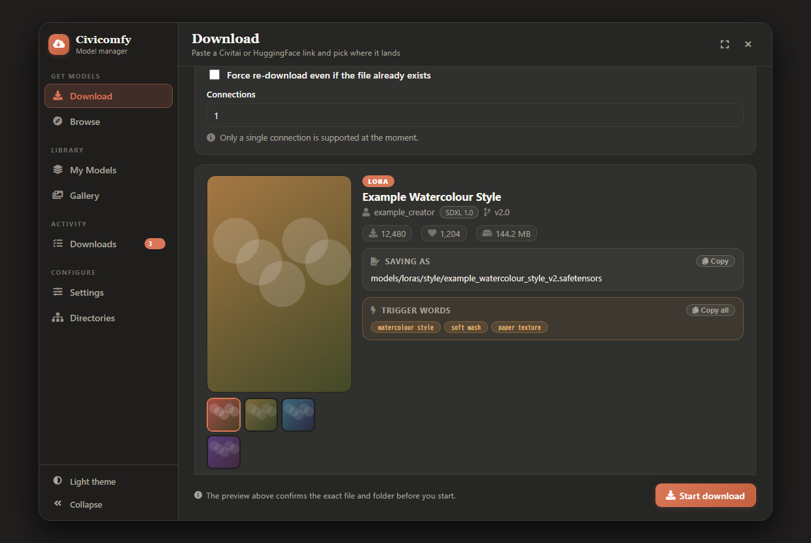
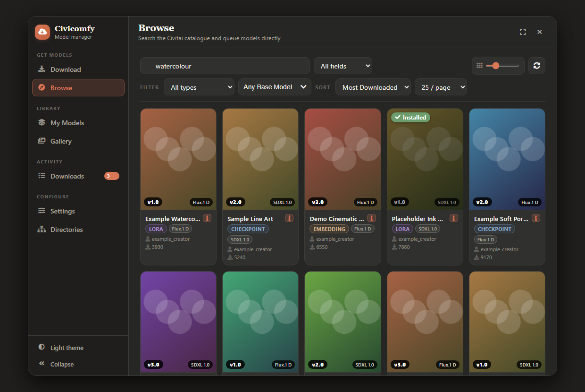
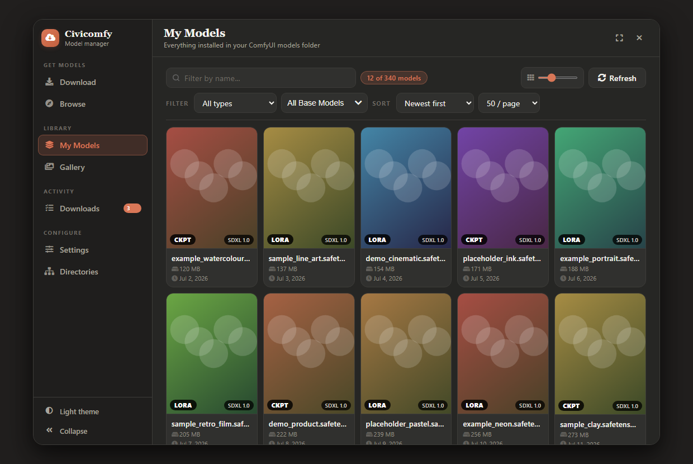
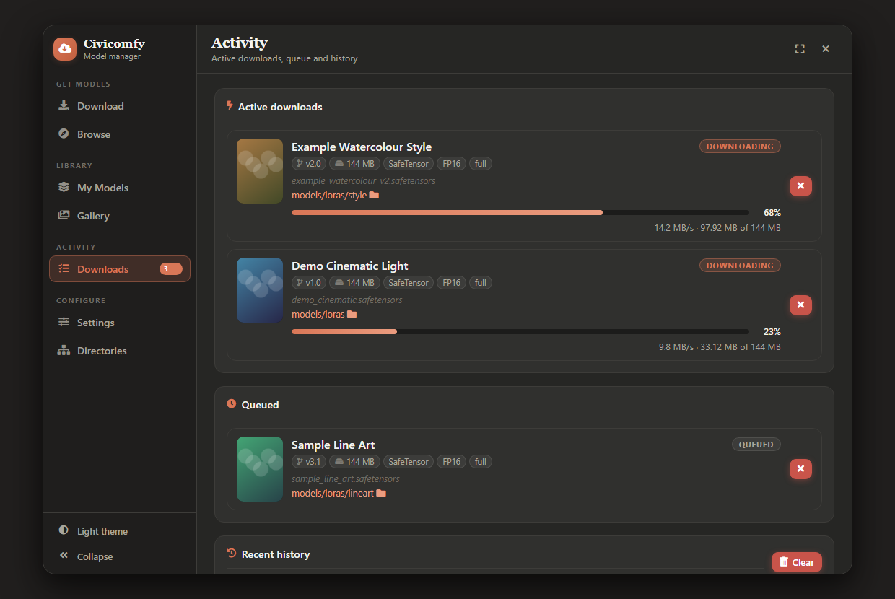
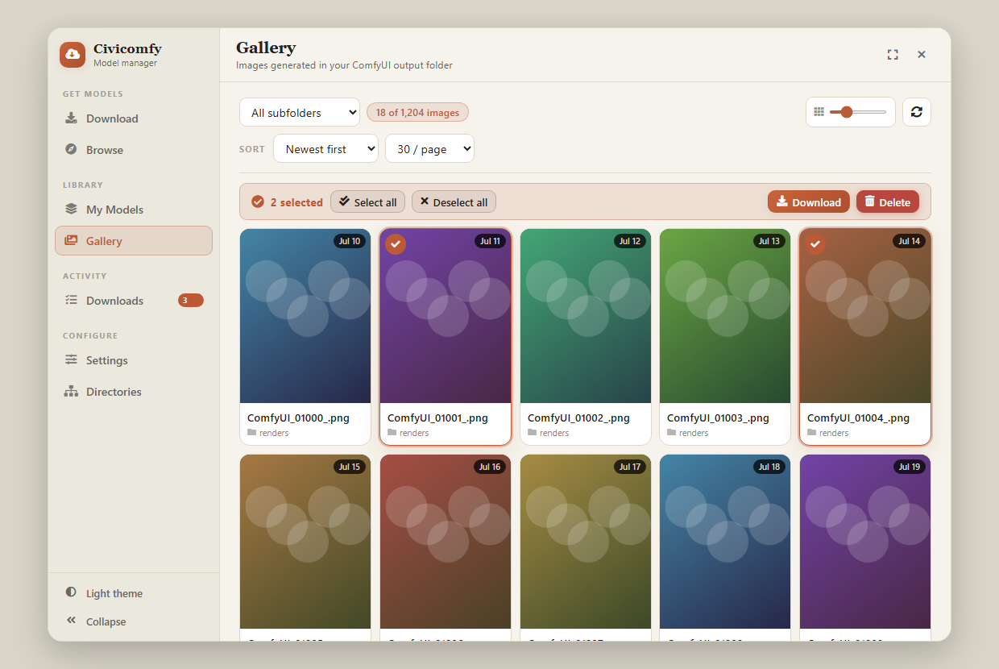
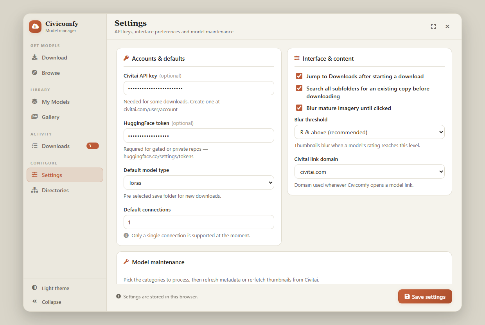
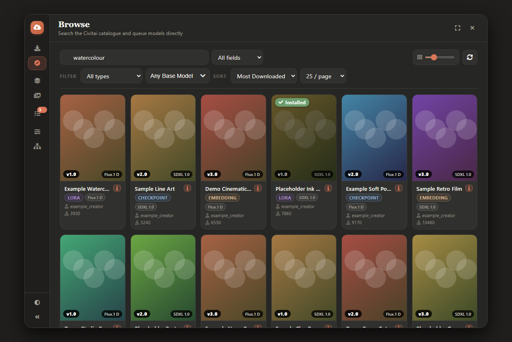

# Civicomfy

<div align="center">

[🇯🇵 日本語](README.md)　|　**🇬🇧 English**

</div>

**A Civitai & HuggingFace model downloader, built into ComfyUI.**

Browse, search, and download models — and manage the ones you already have — without leaving ComfyUI. One button in the toolbar opens everything.

---

## What it does

- 🔍 **Browse & search** Civitai's catalogue (powered by Meilisearch)
- ⬇️ **Download** from Civitai *or* HuggingFace by URL/ID
- 📂 **Auto-saves** to the right ComfyUI folder (checkpoints, loras, vae, etc.)
- 🗂️ **My Models** — see, sort, and delete locally installed models
- 🖼️ **Gallery** — browse the images *and videos* your workflows produced
- 📊 **Downloads** — watch active transfers, queue, and history in real time
- 🎨 **Claude theme** — one warm design system, in dark or cream

---

## Screenshots



The preview resolves before you commit: exact file, exact folder, trigger words ready to copy.



<table>
<tr>
<td width="50%"><br><em>Browse — search, filter, queue</em></td>
<td width="50%"><br><em>My Models — everything on disk</em></td>
</tr>
<tr>
<td width="50%"><br><em>Downloads — active, queued, history</em></td>
<td width="50%"><br><em>Gallery — light theme, multi-select</em></td>
</tr>
<tr>
<td width="50%"><br><em>Settings — light theme</em></td>
<td width="50%"><br><em>Sidebar collapsed to an icon rail</em></td>
</tr>
</table>

> Captured from the real interface; model names, thumbnails and counts are placeholder data.

---

## Install

```bash
cd ComfyUI/custom_nodes
git clone https://github.com/KBYSHanahira/Civicomfy.git
```

Restart ComfyUI. A **Civicomfy** button appears in the top-right toolbar.

---

## Get started in 30 seconds

1. Click **Civicomfy** in the toolbar
2. Open **Settings** → paste your [Civitai API Key](https://civitai.com/user/account)
3. Paste a Civitai or HuggingFace link into the **Download** tab
4. Click **Start download** — watch progress in **Downloads**

> 💡 No API key? You can still browse and download HuggingFace files. Civitai downloads need a free API key.

---

## The interface

**Sidebar navigation.** Sections are grouped by what you're trying to do —
**Get models** (Download, Browse), **Library** (My Models, Gallery),
**Activity** (Downloads), **Configure** (Settings, Directories). The current
section's name and a one-line description sit in the top bar, and a badge on
**Downloads** counts transfers in flight from anywhere in the app.

**It shrinks with the window.** Collapse the sidebar to a 60 px icon rail, or let
it become a slide-over drawer when the window gets narrow. Every panel keeps its
own scroll position, and long forms keep their primary action pinned to the
bottom instead of hiding it below the fold.

**Claude theme, two palettes.** Warm dark by default, warm cream on request —
switch with the toggle at the bottom of the sidebar. Every colour comes from one
token set, so both palettes stay consistent down to the badges and progress bars.
Your choice is remembered per browser.

**Keyboard & mouse.** `Esc` closes the window (or just the panel on top of it),
arrow keys page through the gallery lightbox, and card grids resize live with the
slider in each toolbar.

---

## The sections

### 📥 Download

Paste any of these and Civicomfy handles the rest:

- Civitai model URL: `civitai.com/models/12345`
- Civitai model ID: `12345`
- Civitai version URL: `…?modelVersionId=67890`
- HuggingFace file URL: `huggingface.co/.../resolve/main/model.safetensors`

**What you get:**
- A live preview of the model (images, file variants, version info)
- Auto-selected save folder based on model type
- Optional: pick a specific file variant (fp16 vs fp8, pruned vs full, etc.)
- Optional: choose a subfolder, or create a new one inline
- Optional: rename the file
- **Duplicate detection** — won't re-download a file that already exists (toggle a deeper check in Settings — scans every subfolder including MKLink/junction-mounted ones)
- **Force Re-download** — overrides duplicate detection when you actually want to overwrite

**Supported Civitai domains:** `civitai.com`, `civit.com`, `civit.red`, `civitai.red`

---

### 🔎 Browse

Search and discover models from Civitai.

- Filter by **type**, **base model** (SDXL, SD 1.5, Flux, Pony, Illustrious, Wan, Hunyuan, +35 more), **sort order**, **page size**
- Click a model card → pre-fills the Download tab
- Each card shows the download size of its latest version; the Info panel lists the size of every version
- NSFW thumbnails are blurred above your chosen threshold (click to reveal); pick **Unlock everything** in Settings to see every model unblurred and unfiltered
- Your filters and search are remembered between sessions

> Browse needs at least one filter active (search text, type, or base model).

---

### 📊 Downloads (Activity)

A live dashboard for everything that's downloading.

- **Active** — current downloads with speed, progress %, time elapsed
- **Queued** — waiting jobs (up to 3 run at once)
- **History** — last 100 finished/failed/cancelled downloads, persisted across restarts
- **Cancel**, **retry**, **open folder**, **clear history**

Polls every 3 seconds while the modal is open.

---

### 🗂️ My Models

Manage models already on disk.

- Recursive scan of every ComfyUI model folder
- Preview thumbnails from Civitai sidecar files (`.preview.jpeg`)
- Filter by type, search by name/path, sort by name/size/date
- **Open on Civitai** • **View Detail** (description, trigger words — click to copy) • **Delete** (with confirmation)
- Supports `.safetensors`, `.ckpt`, `.pt`, `.pth`, `.bin`, `.gguf`, `.sft`

---

### 🖼️ Gallery

A grid view of your ComfyUI **output** folder — the images and videos your workflows actually produced.

- **Images and videos** (`.mp4` / `.webm` / `.mov` / `.m4v`). Video cards show the first frame as a poster with a ▶ badge, so a clip reads as a video at a glance
- **Play videos in the lightbox** with native controls (play, seek, volume) — no `ffmpeg` or extra dependency required
- Filter by subfolder, sort by date or name, resize thumbnails live
- Lightbox with arrow-key navigation and zoom
- Multi-select for batch **download** or **delete**

---

### 🧭 Directories

Point any model type at a folder of your choosing — handy when checkpoints live
on a different drive from LoRAs. Leave a row blank to keep ComfyUI's default
(shown as the placeholder). Paths are validated on the server before they're
saved, and overrides persist in `directory_overrides.json`.

---

### ⚙️ Settings

| Setting | What it does |
|---|---|
| **Civitai API Key** | Required to download from Civitai |
| **HuggingFace Token** | Needed for gated/private HF models |
| **Default model type** | What's pre-selected in the Download tab |
| **Auto-open Downloads** | Jumps to Downloads after queuing a download |
| **Deep subfolder check** | When checking for duplicates, scans every subfolder (and MKLink/junction-mounted drives) instead of just the target folder |
| **Hide mature content** | Filter NSFW out of Browse results |
| **NSFW blur threshold** | Blur thumbnails at this `nsfwLevel` and above (0–128). **Unlock everything** turns blurring off *and* stops Civitai from withholding results — models whose imagery is entirely explicit are only listed at that setting |
| **Model Maintenance** | Bulk-refresh metadata or thumbnails for any category |

Settings live in a browser cookie (365 days). API keys never touch the server's filesystem — they're sent per-request from your browser.

---

## How downloads work

1. **HEAD request** to resolve the final URL and check if the server supports byte-range requests
2. **Big files (>100 MB) with range support** → split into N parallel chunks
3. **Otherwise** → single streaming connection
4. Each chunk retries up to **3 times** with exponential backoff
5. Progress updates every 0.5 s
6. Cancel cleanly removes partial files

> ⚠️ **Known issue:** Multi-connection downloads currently have a bug. Use 1 connection for reliability.

### Sidecar files (Civitai only)

| File | What's inside |
|---|---|
| `<name>.cminfo.json` | Model metadata, base model, trigger words, description, sample prompts |
| `<name>.preview.jpeg` | 450 px thumbnail from Civitai |

HuggingFace downloads don't create sidecars.

### Limits

| | |
|---|---|
| Concurrent downloads | 3 |
| History entries | 100 |
| History storage | `download_history.json` |

---

## MKLink / symlink / junction support

If you store models on an external drive and link them in with `mklink /D` or `mklink /J`, Civicomfy follows the links — both the subfolder dropdown and the duplicate-file scanner walk into them. Circular links are detected and skipped.

---

## Changelog

### 2.4.0

- **Model cards show their download size.** Civitai's search index carries no file information at all, so the size is resolved from the REST API in one batched request per page (`server/routes/ModelFileSizes.py`) and filled into the cards after they are already on screen — browsing never waits for it. Sizes of published versions never change, so they are cached for the life of the process. The Info panel lists the size of every version, which is what you actually pick between when a model has twenty of them.
- **"Unlock everything" now unlocks the results too, not just the blur.** The search request always carried a rating filter, and because a model's `nsfwLevel` is a *list*, that filter dropped every model whose imagery is exclusively explicit — 11,504 LoRAs alone were invisible with no indication anything was missing. At the unlock setting Browse and Search now ask for every rating level.
- **Fixed: the model type dropdown was blank on first run.** The default was `checkpoint`, but the options come from ComfyUI's own folder names (`checkpoints`), and assigning a missing value to a `<select>` silently blanks it — leaving the Download form with no model type at all. The saved value is now resolved against the real option list.
- **Fixed: long version names spilled out of Browse cards.** `text-overflow` cannot act on a bare text node between two other children, so names ran up to 61px past the card edge instead of ellipsing.
- **Fixed: on touch devices the action overlay covered every thumbnail.** With no hover to reveal it, the overlay sat open permanently and you could not see a single model image. Tapping the artwork now opens the actions for that card only.
- **Fixed: the "All (N)" button on a Browse card did nothing.** It toggled a container that only ever existed in the old Search tab's markup. It now opens the info panel, where every version is listed.
- **Fixed: an empty bordered box sat above Start download.** The container had a `:empty` rule to hide it, but an HTML comment inside it meant `:empty` never matched.
- **Fixed:** overlapping `<code>` chips in wrapped hint text, colliding type / base-model badges on narrow cards, download names crushed to `Meg…` in Activity, and a doubled gap between wrapped form fields.
- **A pass over the whole interface at phone, tablet and desktop widths.** Toolbar filter captions no longer strand themselves beside the wrong control when a row wraps (their widths lived in inline styles that beat every media query); directory rows put the path and its reset button on one line; touch pointers get ~40px hit areas throughout, including the card-size slider, whose grabbable area was 4px tall. Verified with a script that walks every element on all seven tabs at five widths in both themes looking for overflow, escaped boxes, overlaps and undersized targets: all zero.
- **Removed the dead Search tab.** Its renderer, handler and stylesheet section had been unreachable since the tab was replaced by Browse — about 350 lines.

### 2.3.0

- **Video playback in the Gallery.** Output-folder videos (`.mp4`, `.webm`, `.mov`, `.m4v`) now list alongside images. Grid cards show the video's first frame as a poster with a ▶ badge, and the lightbox plays the clip with native controls (play, seek, volume). Rendered client-side with a `<video>` element pointed at ComfyUI's `/view` route — which already serves the files with HTTP range support — so **no `ffmpeg` or extra dependency** is required. The output scan and delete routes now recognise video extensions and tag each entry with a `media_type` the client keys its rendering off.

### 2.2.0

- **Download and Delete buttons in the Gallery lightbox.** Previously the only actions were previous / next / close, so saving or removing an image meant closing the viewer and finding its card again. Delete asks for confirmation, then advances to the next image so you can keep culling without reopening; it closes the viewer when nothing is left. Download always fetches the full-resolution original, not the thumbnail.
- **Fixed: clicking a Gallery card after deleting one opened the wrong image.** Cards captured their grid position when built, but deleting an image shifts every later one down a slot, so the stored positions silently pointed at a neighbour. Cards now read their position at click time and are renumbered whenever one is removed. This affected the existing per-card delete too, not just the new lightbox button.
- **Fixed: arrow keys changed the image behind the delete confirmation.** The dialog swallows Escape and Enter but not the arrows, so the lightbox kept navigating underneath it while the prompt was open.

### 2.1.0

A performance release. Both image grids were sending full-resolution originals to the browser to draw thumbnails a few hundred pixels wide, which is what made them stutter.

**Thumbnails**

- **New cached thumbnail service** (`server/routes/Thumbnails.py`). Images are downscaled once to WebP, cached on disk, and served with an immutable cache header. The source file's mtime is part of the URL, so a regenerated image gets a new URL instead of a stale hit.
  - Gallery: a page of 50 dropped from **276 MB to ~1.1 MB**.
  - My Models: a page of 50 dropped from **134 MB to ~1.8 MB**.
  - Decoding runs on a small bounded thread pool, off the event loop, so browsing never blocks the ComfyUI server or steals CPU from a running generation. Concurrent requests for the same image collapse into one decode.
  - Cache is capped at 4000 files and prunes oldest-first. First visit after upgrading generates the initial set (~100 ms per image); everything after that is served from disk.
- **Lightboxes open instantly** — the cached thumbnail paints first, then the full-size image swaps in once it arrives. Gallery lightbox also preloads the neighbouring images so arrow-key navigation doesn't stall.
- **Send to Workflow** now puts a thumbnail URL on the node instead of the full preview. The node draws into a 580 px box and keeps its bitmap alive for as long as it's in the workflow, so this was costing multiple MB of canvas memory per node.
- **Download tab** asks Civitai's CDN for display-sized images. Preview URLs previously came through as `original=true` — the full upload — and were scaled down in the browser.

**Scrolling**

- My Models cards now use `content-visibility`, so cards scrolled out of view skip layout and paint. The Gallery grid already did this, which is why only My Models stuttered.
- The hover-overlay blur on both grids is now scoped to `:hover`. It was declared unconditionally, giving every card three permanently-composited layers — **151 across a page, now 1**.
- My Models builds its cards in a document fragment instead of appending 50 times into the live grid.

**Fixes**

- The **base-model filter selection is now remembered** between sessions. It was never written to the saved settings, so it reset on every reload.
- Cancelling or failing a **multi-connection download** no longer abandons its worker threads. They were left running while the temp directory was deleted underneath them, which on Windows strands a `.<name>.parts_<id>` folder in your model directory. Threads are now joined with a bound, and cleanup retries before giving up.
- The output-folder scan is cached briefly instead of re-walking every image on each page click, sort change, and subfolder switch. Deleting an image invalidates it, and **Refresh** forces a fresh scan.

---

## Contributing

PRs welcome.
